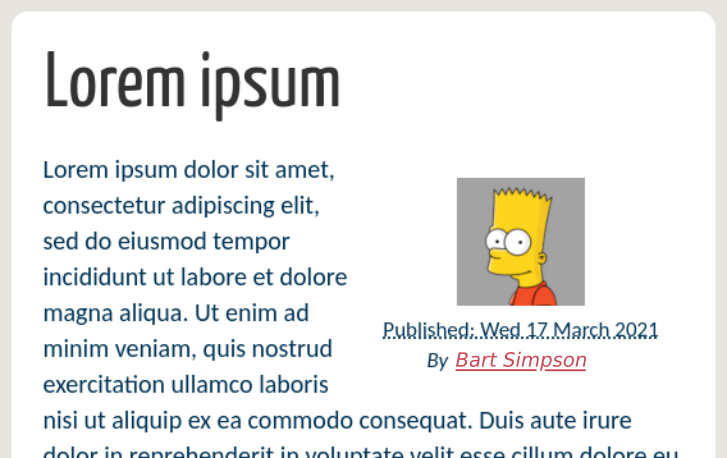

Avatar: A Plugin for Pelican
============================

[](https://github.com/pelican-plugins/avatar/actions)
[](https://pypi.org/project/pelican-avatar/)


This plugin allows the inclusion of [Libravatar][] or [Gravatar][] user profile pictures, according to the email address of the article's author.

[Libravatar]: http://www.libravatar.org
[Gravatar]: http://www.gravatar.com

Installation
------------

This plugin can be installed via:

    python -m pip install pelican-avatar

Usage
-----

### Specifying the author's email address

The default email address is taken from the `AVATAR_AUTHOR_EMAIL` variable in the Pelican configuration fileThis default value can be overridden in a per-article basis, according to the email address found in the article's metadata.

In ReSTructuredText:

```rst
:email: bart.simpson@example.com
```

In Markdown:

```markdown
Email: bart.simpson@example.com
```

The avatar image corresponding to the specified email is searched at Libravatar. If it is not found there, it is searched (transparently) at Gravatar. If the avatar for the specified email address is not found at any of those services, a default picture is shown. The default for the "missing picture" can be defined in the configuration variable `AVATAR_MISSING`.

### Adjusting the template

This plugin assigns the `author_avatar` variable to the Libravatar URL and makes the variable available within the article's context. For instance, you can add the following to a template file (for example, to the `article_infos.html` template file), just before the infomation about the author:

```html

<div align="center">
        
</div>


```

This will yield the following result (with the notmyidea theme):



Page templates work in a similar way:

```html

<div align="center">
        
</div>

```

To use in common templates, such as `base.html`, you can do something like this:

```html

<div align="center">
        
</div>

```

Or if you want to support optional overriding of the email in articles or pages,
while still taking the global configuration if neither is available:

```html

  

  


<div align="center">
        
</div>

```

Configuration
-------------

The following variables can be set in the Pelican configuration file:

- `AVATAR_AUTHOR_EMAIL`: site-wide default for the author's email address.

- `AVATAR_MISSING`: The default for the missing picture. This can be either a url (e.g. `"http://example.com/nobody.png"`) or the name of a library of logos (e.g. `"wavatar"`; for the full set of alternativas, see the [Libravatar API](https://wiki.libravatar.org/api/)).

- `AVATAR_SIZE`: The size, in pixels, of the profile picture (it is always square, so the height is equal to the width). If not specified, the default size (80×80) is returned by Libravatar.

- `AVATAR_USE_GRAVATAR`: By default, the avatar is searched at the Libravatar service. Search at the Gravatar service can be forced by setting this configuration variable to `True`.

Credits
-------

Inspiration for this plugin came from the
[gravatar plugin](https://github.com/getpelican/pelican-plugins/tree/master/gravatar).

Contributing
------------

Contributions are welcome and much appreciated. Every little bit helps. You can contribute by improving the documentation, adding missing features, and fixing bugs. You can also help out by reviewing and commenting on [existing issues][].

To start contributing to this plugin, review the [Contributing to Pelican][] documentation, beginning with the **Contributing Code** section.

[existing issues]: https://github.com/pelican-plugins/libravatar/issues
[Contributing to Pelican]: https://docs.getpelican.com/en/latest/contribute.html

Author
------

Copyright (C) 2015, 2021  Rafael Laboissière (<rafael@laboissiere.net>)

License
-------

This project is licensed under the AGPL-3.0 license.
